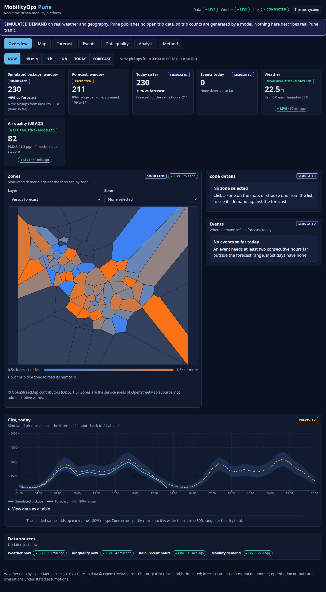
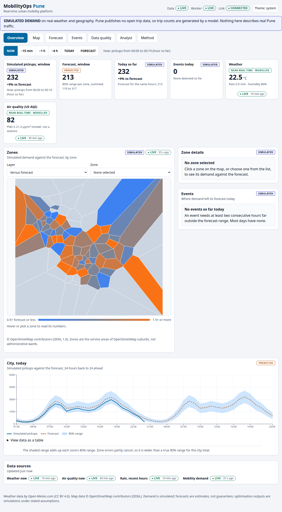
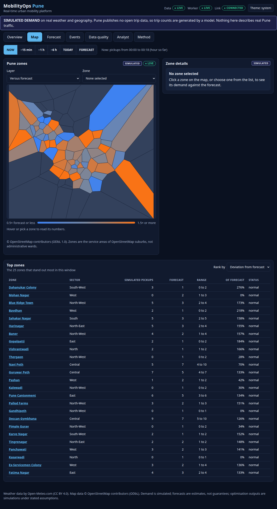
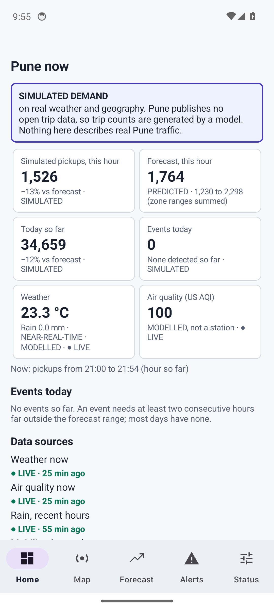
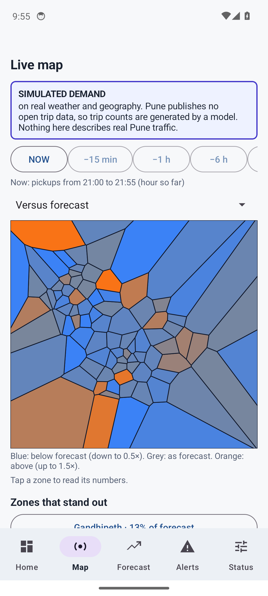
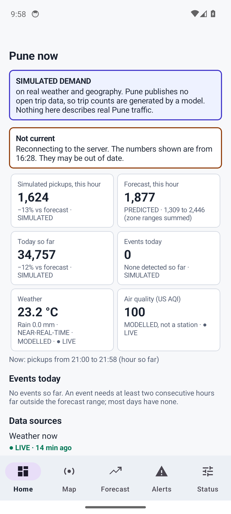

# MobilityOps

[](https://github.com/jayraj0975/mobilityops/actions/workflows/ci.yml)

Urban mobility intelligence and operations. Validated on a full year of public NYC taxi and for-hire data, and
run as a real-time platform for Pune on **simulated** demand: demand analytics, day-ahead forecasts with honest
uncertainty, anomaly detection, **simulated** fleet-repositioning scenarios, a real-time view, a REST API, a React
dashboard, a native Android app and a tightly controlled AI analyst.

**Built to be self-hosted:** run it on your own machine or server with Docker Compose or systemd, and
point the web dashboard or the Android app at it ([docs/SELF_HOSTING.md](docs/SELF_HOSTING.md)). A public
demo is also up at <https://mobilityops.onrender.com> (free hosting: the first request after idle takes
tens of seconds; see [docs/DEPLOYMENT.md](docs/DEPLOYMENT.md)); it serves the same full-year data as the
results below, including the Live tab.


**Live on Render's free plan** (each sleeps after ~15 minutes idle; the first request takes about half a minute):
[New York, real data](https://mobilityops.onrender.com) and
[Pune, **simulated demand** on live weather](https://mobilityops-pune.onrender.com).

## Pune: a real-time platform on simulated demand

The same pipeline also runs as a real-time console for **Pune** (`MOBILITYOPS_MODE=pune`). Read this first:

> **No open source of Pune taxi, ride-hail or bus demand exists** (checked source by source in
> [PUNE_DATA_SOURCES](docs/PUNE_DATA_SOURCES.md)). Trip counts are therefore **SIMULATED** by a documented model and are
> labelled so on every screen, API response and document. What is real: hourly rain and current weather (Open-Meteo,
> model output, not station readings), modelled air quality, the Maharashtra holiday calendar, and 91 zones built from
> OpenStreetMap suburbs. Nothing in the Pune console describes real Pune traffic, and nothing in it is called LIVE.

What it demonstrates is the platform: a separate ingestion worker polling each source on its own schedule, freshness
(LIVE, DELAYED, STALE, OFFLINE) computed from each source's own timestamps, failures recorded and never papered over, a
server-sent event stream, a map-based web console with NOW / -15m / -1h / -6h / TODAY / FORECAST, forecast ranges, events and a
data-quality centre, and an Android app with Kotlin screens.

```bash
export MOBILITYOPS_MODE=pune
python -m mobilityops.cli pune-build            # rain history + zones + simulated demand, quality-gated (seconds)
python -m mobilityops.cli forecast-eval && python -m mobilityops.cli forecast-train && python -m mobilityops.cli anomalies
python -m mobilityops.cli pune-worker &         # the ingestion worker: the only writer of the live state
make web-build && make serve                    # console at http://127.0.0.1:8000
```

| Area | Status |
|---|---|
| Live sources: current weather (15 min), modelled air quality (60 min), recent rain, verified against the real services | VERIFIED |
| Demand, events, scenarios | SIMULATED (by design) |
| Forecast on simulated demand: WAPE 19.5% vs 22.8% best baseline, 79.6% interval coverage | VERIFIED as measured; says nothing about real Pune |
| Traffic (TomTom), station air quality (OpenAQ), PMPML bus timetable | **NOT IMPLEMENTED**: listed as not configured; no adapters |
| Web console: 22 component tests, 24 real-browser tests including WCAG A/AA scans of every page in both themes, offline recovery, phone width | VERIFIED |
| Android app (Kotlin screens; debug APK, signed release APK, AAB): 45 unit tests, lint clean, run on an Android 14 emulator against the live server, including the server being killed and restarted | VERIFIED on an emulator; **not** on a physical phone |
| Hardened containers (API and worker) serving live data; `docker stop` in 5.6 s / 0.3 s; Caddy config validated for the www/api hostnames | VERIFIED locally |
| A public domain with DNS and a public certificate; `docker compose up` itself; the phone app over HTTPS to a real domain | **NOT VERIFIED** (no domain was deployed; see [PRODUCTION](docs/PRODUCTION.md)) |

| Console (dark) | Console (light) | Map |
|---|---|---|
|  |  |  |

| Android: Home | Android: Map | Android: server unreachable |
|---|---|---|
|  |  |  |

The screenshots are of the real console and the real app on an emulator, against the live worker. The last one is the
app after the server was killed: it says the numbers are not current and when they are from, and keeps them.

Start with [LIVE_DATA](docs/LIVE_DATA.md) (classes, freshness, the simulator, the event rule),
[PRODUCTION](docs/PRODUCTION.md), [OPERATIONS](docs/OPERATIONS.md) and [VIVA](docs/VIVA.md).

> **What this is not.** It is not connected to any transport network and there is no fleet data in
> the open datasets. Optimisation results are *simulated scenarios under explicit assumptions*.
> Forecasts are estimates, not guarantees. Anomaly explanations describe what *coincided* with a
> deviation; they never assert a cause. Synthetic sample data is always labelled
> `TEST / SYNTHETIC DATA` and is never mixed with real data.

## Results at a glance

Real data: NYC TLC trips for all of 2024 (40,268,069 valid yellow-taxi trips after cleaning, 263 zones), plus
green taxis and high-volume for-hire vehicles for the service view, and NOAA daily weather. Every figure links
to a report generated from the run that produced it (nothing here is typed in by hand; regenerate with the
commands in [docs/EVALUATION.md](docs/EVALUATION.md)). The earlier January to May results are kept in
[reports/jan_may_2024](reports/jan_may_2024/README.md) for comparison; the two are not directly comparable
because the test window moved from April and May to November and December.

| Area | Result | Status |
|---|---|---|
| Data platform | 41,169,720 raw yellow rows → 40,268,069 valid; 901,651 quarantined with a reason each (2.19%, which trips the 2% warning threshold: refunds and adjustments grew from 1.3% of rows in January to 2.2% in December); 29 of 30 quality checks PASS and that one WARN (the two dropoff-accounting checks are new: 273,264 dropoffs, 0.68%, are placed nowhere and reconcile exactly); every fact table reconciles to its trip files exactly | VERIFIED |
| Services | Green taxis (653,351 pickups) and high-volume for-hire vehicles (239,431,692) are aggregated to zone-hour counts with the same cleaning rules and reconciled to the trip. Of the pickups counted in the three TLC files, for-hire vehicles are 85.4%, yellow taxis 14.4% and green 0.2% (not a share of all mobility). Forecasts, anomalies and scenarios cover yellow taxis only | VERIFIED |
| Day-ahead forecast (per zone, hourly) | LightGBM WAPE **19.5%** vs 26.3% for the best baseline (4-week seasonal mean), 31.6% (last week) and 30.0% (yesterday); 56 held-out days (6 Nov to 31 Dec), walk-forward. The model is ahead of the best baseline by 6.8 percentage points (95% interval 4.2 to 10.2), but almost all of that comes from the holiday weeks: on the first fold (mostly ordinary days) it is 16.0% against 16.4%, on the New Year fold 26.1% against 43.2%. 80% intervals covered 79.6% of held-out values. [Report](reports/forecasting_real.md) | VERIFIED |
| Holiday features | Two calendar features (long weekend, distance to the nearest holiday) were pre-registered before any June to December forecast was looked at and adopted by the rule fixed in advance: overall WAPE 20.2% → 19.5% (interval +0.38 to +1.15 points), holiday hours 40.7% → 38.1%. A secondary check on August to September, with one holiday, went the other way (-0.53 points), and the gain is not confined to holidays, so the features may partly act as a season signal. [Report](reports/holiday_experiment_real.md), [pre-registration](docs/PREREGISTRATION_HOLIDAY.md) | VERIFIED; the mechanism is not |
| Anomaly detection | 307 events in the 56 scored days (63 medium or high), 17% of them on 31 December and 14% on Thanksgiving. No real labels exist, so precision is **UNVERIFIED**; on synthetic data with planted anomalies 3 of 3 were found with 0 extras, and sensitivity on real noise is measured by injection (a 2x surge lasting 3 hours is found 18% of the time in quiet zones and 80% in the busiest). [Report](reports/anomalies_real.md) | mechanism VERIFIED, real precision UNVERIFIED |
| Repositioning simulation | Planning with the forecast adds 0.50 points of served share (95% interval 0.36 to 0.65); the unattainable oracle adds 2.56. Planning with the simple seasonal-mean forecast is indistinguishable from planning with LightGBM (-0.03 points, interval -0.14 to +0.07). [Report](reports/optimization_real.md) | engine VERIFIED; outcomes are SIMULATED |
| AI analyst (deterministic) | Development set 80 questions: 90.0% first run, 100% after fixes made against that set (optimistic). Three held-out sets of 40, each run once before any fix: **77.5%**, **60.0%** and **80.0%** (72.5% pooled, 87 of 120); all are development data from then on. Re-run on the full-year data, the four sets score 187 of 200: 11 failures are questions naming May days that are no longer held-out (the analyst correctly says there is no data), 2 are older known failures, and the re-run exposed two real defects the old data had hidden (an ignored "low severity" filter and a past date silently replaced by tomorrow's forecast), now fixed. Grounding and non-causal wording held at 100%. Expect roughly 60 to 80% on new phrasing. [Report](reports/ai_evaluation_real.md) | VERIFIED as measured |
| AI analyst (LLM mode) | Implemented, tested only against a mocked transport; never run with a real key | **UNVERIFIED** |
| Real time | A labelled replay of the held-out days plus live Citi Bike and weather feeds, on a server-sent-events stream; checked end to end against the real feeds and through a hardened container | VERIFIED |
| Android app | Native, built with Gradle (Java and Kotlin); the New York tabs (release 1.0.0, signed APK) and the Pune tabs (2.0.0) were run on an Android 14 emulator against real servers; 45 unit tests, lint clean | VERIFIED on an emulator (not a physical phone) |
| Self-hosting | Docker Compose, systemd, optional HTTPS; the image was built and run with a read-only filesystem, no capabilities and read-only data mounts: 401 without a key, data with it, live stream through it | VERIFIED locally (Compose itself was not run: the plugin is not installed here) |
| API | Contract tests including the service and live endpoints, plus a concurrency smoke test on the earlier data: 0 errors in 420 requests, p95 415 ms on a 12-thread machine | VERIFIED |
| Interface | Component tests (run under 4 timezones) and real-browser tests including axe-core WCAG 2.1 A/AA scans in light and dark mode, keyboard use, phone width, and a dropped live stream recovering | VERIFIED |
| Tests | 660 Python tests at 95% line coverage (CI runs the suite on Python 3.12, 3.13 and 3.14); 79 web unit tests (also run under four timezones); 48 real-browser tests (24 per mode); 45 Android unit tests plus lint; ruff, ruff-format and mypy clean; `pip-audit` and `npm audit` report no known vulnerabilities; no secrets in the tree or git history | VERIFIED |
| Authentication beyond one shared API key, per-user accounts, distributed-abuse protection | not built | NOT IMPLEMENTED |

## Screens

| Forecast vs baselines | Anomalies | Simulated scenarios | Analyst |
|---|---|---|---|
|  |  |  |  |

## Real time, and the Android app

The **Live** tab streams two clearly different things over server-sent events, each labelled on screen:

* **REPLAY, not live.** NYC publishes taxi trips monthly, so no live taxi feed exists. The tab replays
  held-out days one hour every few seconds on a clock shared by every viewer: the forecasts the model
  made *before* those days, against what happened, with running error and anomaly events.
* **LIVE.** Real public data fetched while someone is watching: Citi Bike station availability and the
  current Central Park weather, each with the publisher's own timestamp. If a source stops answering, the
  last good reading stays on screen and says it is not current.

The same stream feeds the **native Android app** ([apps/android](apps/android/README.md)), built with
Gradle (signed APK: [Releases, android-v2.1.0](https://github.com/jayraj0975/mobilityops/releases/tag/android-v2.1.0): includes the Pune tabs; earlier releases remain)): Live, Overview, Forecast, Anomalies and Settings tabs, verified on an Android 14 emulator against the
real-data server.

| Live (replay) | Live (feeds) | Overview | Forecast | Anomalies |
|---|---|---|---|---|
|  |  |  |  |  |

## Quick start

Everything below works offline in **sample mode** (deterministic synthetic data).

```bash
make setup                  # virtualenv + Python dependencies (Python 3.12+)
make sample                 # generate the SYNTHETIC sample
export MOBILITYOPS_MODE=sample
python -m mobilityops.cli ingest && python -m mobilityops.cli build
python -m mobilityops.cli forecast-eval && python -m mobilityops.cli forecast-train
python -m mobilityops.cli anomalies
make web-install web-build  # needs Node 20+ (CI and the image use 24, the current LTS)
make serve                  # API + UI at http://127.0.0.1:8000  (docs at /docs)
make check                  # lint + types + tests, exactly what CI runs
```

Real data (about 50 MB per month of trips; needs internet; first run downloads, later runs are
cached and hash-checked):

```bash
export MOBILITYOPS_MODE=real
python -m mobilityops.cli ingest --start 2024-01 --end 2024-12 --services green,fhvhv   # several GB; resumes if interrupted
python -m mobilityops.cli build           # stops at a failed quality gate; keeps the last good database
python -m mobilityops.cli forecast-eval   # a few minutes on 12 cores
python -m mobilityops.cli forecast-train && python -m mobilityops.cli anomalies
python -m mobilityops.cli optimize-backtest   # long: it includes the sensitivity runs
make serve
```

Leave out `--services green,fhvhv` for yellow taxis only (about 0.6 GB for the year).

Self-hosted with Docker (a hardened container that requires an API key; the image contains no data):

```bash
cp deploy/mobilityops.env.example .env    # set MOBILITYOPS_API_KEY
docker compose up -d --build              # then open http://127.0.0.1:8000
```

The Compose file, a systemd unit and an optional HTTPS proxy are in [docs/SELF_HOSTING.md](docs/SELF_HOSTING.md).

## Commands

| Command | Does |
|---|---|
| `sample`, `ingest`, `build`, `status` | data platform: bronze → silver (quarantine) → gold, with quality gates; `ingest --services green,fhvhv` adds green taxis and high-volume for-hire vehicles |
| `forecast-eval`, `forecast-report`, `forecast-train` | walk-forward evaluation, generated report, final model |
| `forecast-holiday-experiment` | the pre-registered holiday-feature comparison ([PREREGISTRATION_HOLIDAY](docs/PREREGISTRATION_HOLIDAY.md)) |
| `anomalies`, `anomaly-report` | residual-based events, sensitivity analysis, generated report |
| `optimize`, `optimize-backtest`, `optimize-report` | one what-if, the backtest, generated report (all SIMULATED) |
| `analyst-benchmark`, `analyst-benchmark-report` | AI benchmark (add `--holdout` or `--holdout2` for the held-out sets) |
| `pune-build`, `pune-worker` | Pune: build the simulated-demand database with a quality gate; run the ingestion worker |
| `serve`, `openapi` | HTTP API, UI and live stream; OpenAPI contract for the frontend types |

Frontend: `make web-check` (lint incl. accessibility rules, types, tests), `make e2e-live` (UI against a running API),
`make e2e-browser` (Playwright with accessibility scans; CI runs it on every push against the synthetic sample).

## Documentation

| | |
|---|---|
| [ARCHITECTURE](docs/ARCHITECTURE.md) | layers, data flow, artifacts, trust boundaries |
| [DATA_DICTIONARY](docs/DATA_DICTIONARY.md) | every table, column and derived artifact |
| [MODELING](docs/MODELING.md) | forecasting, anomaly detection and optimisation methods and findings |
| [EVALUATION](docs/EVALUATION.md) | how every result was produced and how to reproduce it |
| [AI_EVALUATION](docs/AI_EVALUATION.md) | the analyst's design, benchmark and where it fails |
| [SECURITY](docs/SECURITY.md) | threat model, controls, what is and is not covered |
| [LIMITATIONS](docs/LIMITATIONS.md) | what these results cannot tell you |
| [DECISIONS](docs/DECISIONS.md) | 21 architecture decision records, including changes made after seeing results |
| [PUNE_DATA_SOURCES](docs/PUNE_DATA_SOURCES.md) | every Pune source investigated: what was called, what was verified, licences, what is used |
| [LIVE_DATA](docs/LIVE_DATA.md) | data classes, freshness states, the schedules, the demand simulator and the live event rule |
| [PRODUCTION](docs/PRODUCTION.md) | your own server and domain: worker, www/api hostnames, HTTPS, monitoring, backups, and what was and was not verified |
| [OPERATIONS](docs/OPERATIONS.md) | commands, what healthy looks like, troubleshooting, observability, measured performance |
| [VIVA](docs/VIVA.md) | likely questions and honest answers, including what is not verified |
| [SELF_HOSTING](docs/SELF_HOSTING.md) | running it on your own machine: Docker Compose, systemd, HTTPS, the Android app, the live feeds |
| [DEPLOYMENT](docs/DEPLOYMENT.md) | how the public demo is built, hosted and rebuilt, and the free-plan limits |
| [PREREGISTRATION_HOLIDAY](docs/PREREGISTRATION_HOLIDAY.md) | the holiday-feature hypothesis and decision rule, committed before the test was run |
| [DATA_SOURCES](docs/DATA_SOURCES.md) | where the data comes from, attribution, what is and is not published |
| [CONTRIBUTING](docs/CONTRIBUTING.md) | development workflow and rules |

## Layout

```
src/mobilityops/   ingestion/ transform/ quality/   data platform
                   analytics/ forecasting/ anomaly/ optimization/
                   analyst/                           tools, planner, guard, benchmark
                   api/                               FastAPI app, services, metrics
                   live/                              replay clock, live feeds, event-stream hub (New York)
                   pune/                              zones, simulator, sources, worker, store, freshness, state hub
                   city.py                            per-city timezone, holiday calendar, wording
apps/web/          React + TypeScript UI, generated API types, unit and browser tests
apps/android/      native Android app (Gradle, Java and Kotlin): stream client, New York and Pune screens, unit tests
deploy/            systemd units (API, worker), Caddy config, environment example (docker-compose.yml is at the root)
benchmarks/        the analyst question sets (development and held-out)
reports/           generated result reports (committed so the numbers are inspectable)
tests/             unit and integration tests (synthetic data only; CI downloads nothing)
```

## Data and license

Code is MIT-licensed. The data is public data from the NYC TLC, NYC Open Data and NOAA; no raw trips are
stored or redistributed here, and this project is not affiliated with those organisations. See
[DATA_SOURCES](docs/DATA_SOURCES.md) and [NOTICE](NOTICE).
