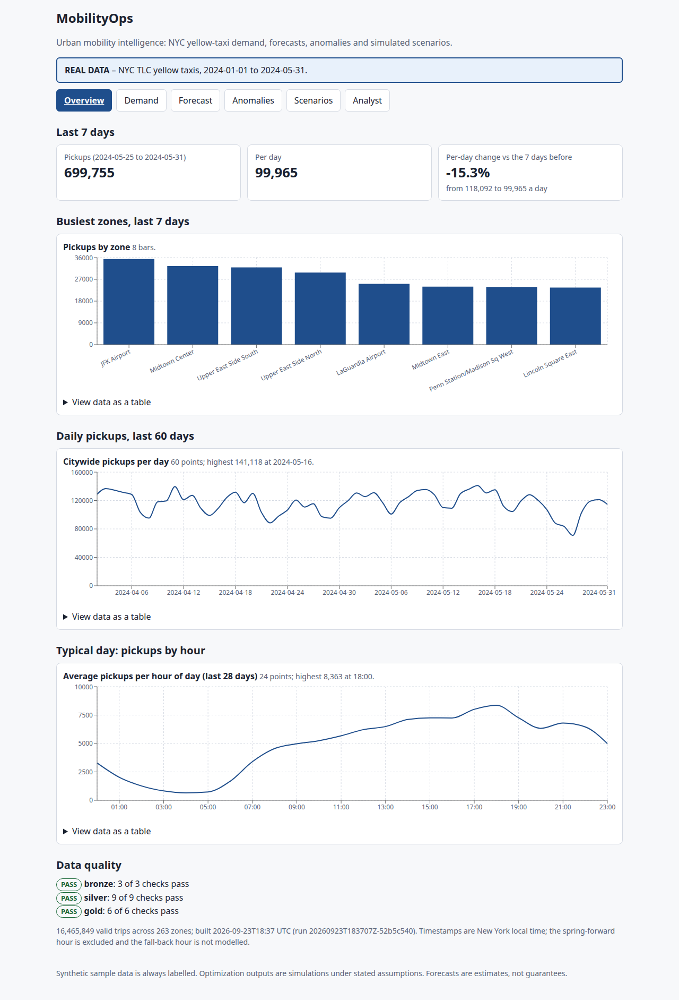
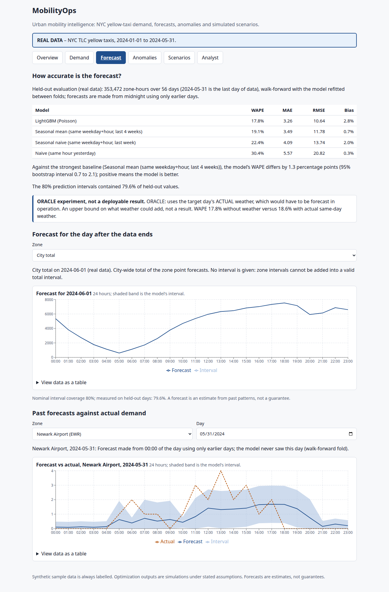
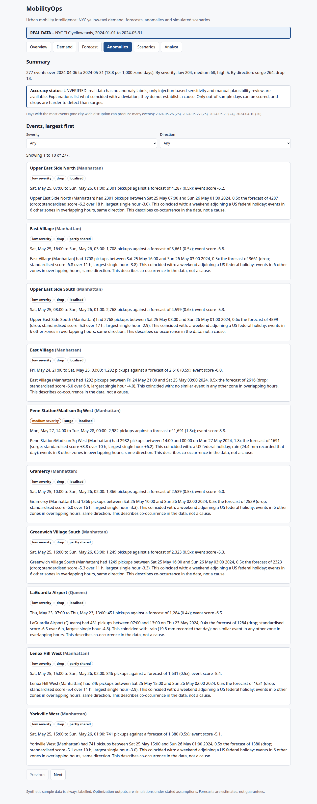
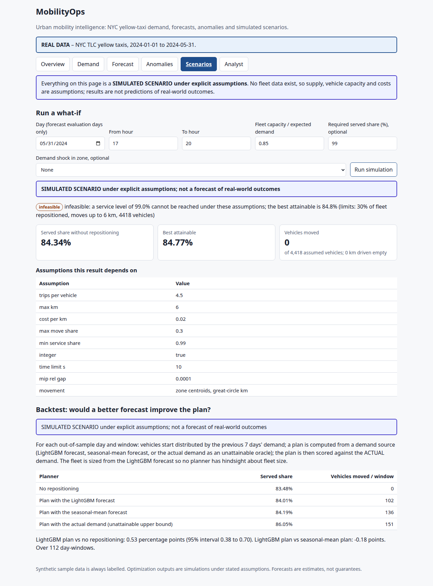
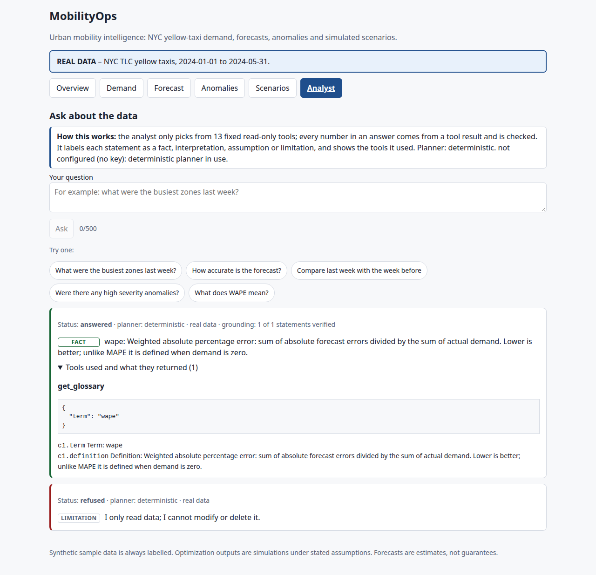

# MobilityOps

Urban mobility intelligence and operations on public NYC yellow-taxi data: demand analytics,
day-ahead forecasts with honest uncertainty, anomaly detection, **simulated** fleet-repositioning
scenarios, a REST API, a React interface and a tightly controlled AI analyst.



> **What this is not.** It is not connected to any transport network and there is no fleet data in
> the open datasets. Optimisation results are *simulated scenarios under explicit assumptions*.
> Forecasts are estimates, not guarantees. Anomaly explanations describe what *coincided* with a
> deviation; they never assert a cause. Synthetic sample data is always labelled
> `TEST / SYNTHETIC DATA` and is never mixed with real data.

## Results at a glance

Real data: NYC TLC yellow-taxi trips, January to May 2024 (16,465,849 valid trips after cleaning,
263 zones) and NOAA daily weather. Every figure links to a report generated from the run that
produced it (nothing here is typed in by hand; regenerate with the commands in
[docs/EVALUATION.md](docs/EVALUATION.md)).

| Area | Result | Status |
|---|---|---|
| Data platform | 16,792,900 raw rows → 16,465,849 valid; 327,051 quarantined with a reason each (1.95%); 18 of 18 quality checks PASS; fact table reconciles to the trip file exactly | VERIFIED |
| Day-ahead forecast (per zone, hourly) | LightGBM WAPE **17.8%** vs 19.1% for the best baseline (4-week seasonal mean), 22.4% (last week) and 30.4% (yesterday); 56 held-out days, walk-forward. The gain over the best baseline is small: 1.3 percentage points (95% interval 0.7 to 2.1). 80% intervals covered 79.6% of held-out values. [Report](reports/forecasting_real.md) | VERIFIED |
| Anomaly detection | 277 events in the 56 scored days (73 medium or high). No real labels exist, so precision is **UNVERIFIED**; on synthetic data with planted anomalies 3 of 3 were found with 0 extras, and sensitivity on real noise is measured by injection. [Report](reports/anomalies_real.md) | mechanism VERIFIED, real precision UNVERIFIED |
| Repositioning simulation | Planning with the forecast adds 0.53 points of served share (95% interval 0.38 to 0.70); the unattainable oracle adds 2.57. Planning with the simple seasonal-mean forecast did slightly *better* than LightGBM. [Report](reports/optimization_real.md) | engine VERIFIED; outcomes are SIMULATED |
| AI analyst (deterministic) | Development set 80 questions: 90.0% first run, 100% after fixes made against that set (optimistic). **Held-out set 40 questions: 77.5%**, run once, not tuned to. Grounding, refusal and non-causal wording held at 100%. [Report](reports/ai_evaluation_real.md) | VERIFIED as measured |
| AI analyst (LLM mode) | Implemented, tested only against a mocked transport; never run with a real key | **UNVERIFIED** |
| API | 28 contract tests plus a concurrency smoke test on real data: 0 errors in 420 requests, p95 415 ms on a 12-thread machine | VERIFIED |
| Interface | 32 component tests (run under 4 timezones), 18 real-browser tests including axe-core WCAG 2.1 A/AA scans in light and dark mode, keyboard use and phone width | VERIFIED |
| Container | Built and run locally: whole pipeline and server inside the image, non-root, healthy | VERIFIED locally |
| Tests | 362 Python tests at 95% line coverage; ruff, ruff-format and mypy clean; `pip-audit` and `npm audit` report no known vulnerabilities; no secrets in the tree or git history | VERIFIED |
| Hosted deployment, authentication beyond an optional API key, rate limiting, TLS | not built | NOT IMPLEMENTED |

## Screens

| Forecast vs baselines | Anomalies | Simulated scenarios | Analyst |
|---|---|---|---|
|  |  |  |  |

## Quick start

Everything below works offline in **sample mode** (deterministic synthetic data).

```bash
make setup                  # virtualenv + Python dependencies (Python 3.12+)
make sample                 # generate the SYNTHETIC sample
export MOBILITYOPS_MODE=sample
python -m mobilityops.cli ingest && python -m mobilityops.cli build
python -m mobilityops.cli forecast-eval && python -m mobilityops.cli forecast-train
python -m mobilityops.cli anomalies
make web-install web-build  # needs Node 20+
make serve                  # API + UI at http://127.0.0.1:8000  (docs at /docs)
make check                  # lint + types + tests, exactly what CI runs
```

Real data (about 50 MB per month of trips; needs internet; first run downloads, later runs are
cached and hash-checked):

```bash
export MOBILITYOPS_MODE=real
python -m mobilityops.cli ingest --start 2024-01 --end 2024-05
python -m mobilityops.cli build           # stops at a failed quality gate; keeps the last good database
python -m mobilityops.cli forecast-eval   # ~1 minute on 12 cores
python -m mobilityops.cli forecast-train && python -m mobilityops.cli anomalies
python -m mobilityops.cli optimize-backtest   # ~25 minutes including the sensitivity runs
make serve
```

Docker (localhost only; the image contains no data or secrets):

```bash
docker build -t mobilityops .
docker run --rm -v "$PWD/data:/app/data" -v "$PWD/artifacts:/app/artifacts" mobilityops sample
docker run -p 127.0.0.1:8000:8000 -v "$PWD/data:/app/data" -v "$PWD/artifacts:/app/artifacts" mobilityops
```

## Commands

| Command | Does |
|---|---|
| `sample`, `ingest`, `build`, `status` | data platform: bronze → silver (quarantine) → gold, with quality gates |
| `forecast-eval`, `forecast-report`, `forecast-train` | walk-forward evaluation, generated report, final model |
| `anomalies`, `anomaly-report` | residual-based events, sensitivity analysis, generated report |
| `optimize`, `optimize-backtest`, `optimize-report` | one what-if, the backtest, generated report (all SIMULATED) |
| `analyst-benchmark`, `analyst-benchmark-report` | AI benchmark (add `--holdout` for the held-out set) |
| `serve`, `openapi` | HTTP API and UI; OpenAPI contract for the frontend types |

Frontend: `make web-check` (types + tests), `make e2e-live` (UI against a running API),
`make e2e-browser` (Playwright with accessibility scans).

## Documentation

| | |
|---|---|
| [ARCHITECTURE](docs/ARCHITECTURE.md) | layers, data flow, artifacts, trust boundaries |
| [DATA_DICTIONARY](docs/DATA_DICTIONARY.md) | every table, column and derived artifact |
| [MODELING](docs/MODELING.md) | forecasting, anomaly detection and optimisation methods and findings |
| [EVALUATION](docs/EVALUATION.md) | how every result was produced and how to reproduce it |
| [AI_EVALUATION](docs/AI_EVALUATION.md) | the analyst's design, benchmark and where it fails |
| [SECURITY](docs/SECURITY.md) | threat model, controls, what is and is not covered |
| [LIMITATIONS](docs/LIMITATIONS.md) | what these results cannot tell you |
| [DECISIONS](docs/DECISIONS.md) | 12 architecture decision records, including changes made after seeing results |
| [CONTRIBUTING](docs/CONTRIBUTING.md) | development workflow and rules |

## Layout

```
src/mobilityops/   ingestion/ transform/ quality/   data platform
                   analytics/ forecasting/ anomaly/ optimization/
                   analyst/                           tools, planner, guard, benchmark
                   api/                               FastAPI app, services, metrics
apps/web/          React + TypeScript UI, generated API types, unit and browser tests
benchmarks/        the analyst question sets (development and held-out)
reports/           generated result reports (committed so the numbers are inspectable)
tests/             unit and integration tests (synthetic data only; CI downloads nothing)
```

## License

MIT
