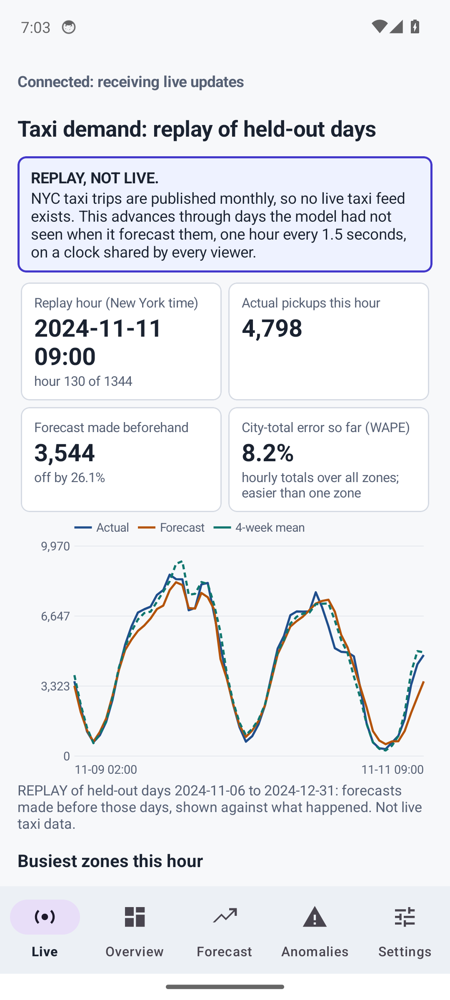
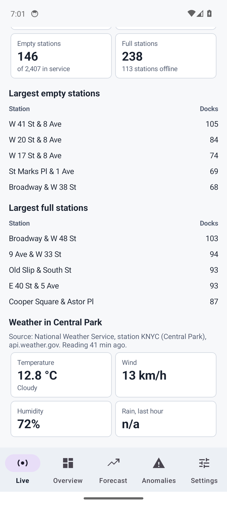
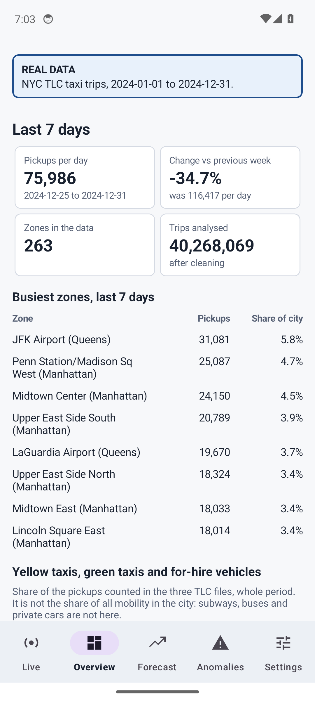
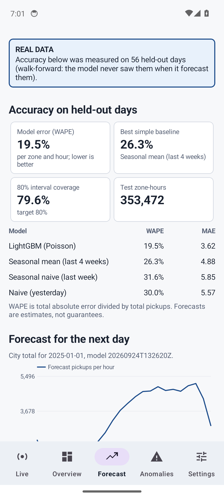
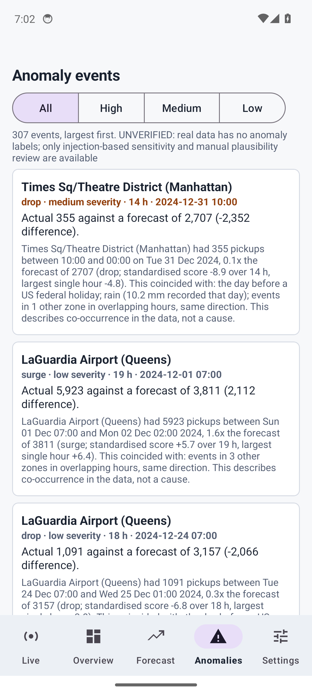

# MobilityOps for Android

A native Android app (Java, Gradle) that shows the MobilityOps dashboard on a phone: a **Live**
tab (a labelled replay of held-out taxi days beside live Citi Bike and weather feeds), the
**Overview**, **Forecast** accuracy and next-day forecast, **Anomalies**, and **Settings** for the
server address and API key. It talks to your own MobilityOps server
([self-hosting](../../docs/SELF_HOSTING.md)); nothing is sent anywhere else.

It uses only platform networking (`HttpURLConnection`) and AndroidX/Material, so there is no
third-party network library to trust. Minimum Android 7.0 (API 24).

**Download:** the signed release APK and its checksum are on the
[Releases page](https://github.com/jayraj0975/mobilityops/releases/tag/android-v1.0.0) (`android-v1.0.0`).

## Screens

| Live | Live feeds | Overview | Forecast | Anomalies |
|---|---|---|---|---|
|  |  |  |  |  |

Screenshots are of the real app on an emulator, on the real data. The Live tab's top section is a
labelled replay; the lower section is live Citi Bike and weather data.

## Build

You need JDK 17 and the Android SDK (platform 34, build-tools 34). Gradle itself comes from the
wrapper.

```bash
export JAVA_HOME=/path/to/jdk-17
export ANDROID_HOME=/path/to/android-sdk          # or put sdk.dir=... in local.properties
./gradlew assembleDebug                           # app/build/outputs/apk/debug/app-debug.apk
./gradlew testDebugUnitTest lintDebug             # 27 unit tests and Android lint
```

Install on a device or emulator: `adb install -r app/build/outputs/apk/debug/app-debug.apk`.

### Signed release build

A release APK must be signed with your own key. Create one and keep it out of the repository (`*.jks`
is ignored), then give Gradle its location through the environment (nothing secret is ever written into
the project):

```bash
keytool -genkeypair -v -keystore ~/mobilityops-release.jks -alias mobilityops \
        -keyalg RSA -keysize 2048 -validity 10000
export MOBILITYOPS_KEYSTORE=~/mobilityops-release.jks
export MOBILITYOPS_KEYSTORE_PASSWORD=...          # the password you chose
./gradlew assembleRelease                         # app/build/outputs/apk/release/app-release.apk
$ANDROID_HOME/build-tools/34.0.0/apksigner verify --verbose app-release.apk
```

Without `MOBILITYOPS_KEYSTORE` the release build is produced unsigned. The release build is minified and
resource-shrunk (about 1.7 MB against 5.6 MB for the debug APK). **Lose the key and you cannot update an
installed copy**; back it up.

## Connecting to the server

Open **Settings** on first launch. From the Android emulator the host computer is
`http://10.0.2.2:8000`; on a phone use the server's address on your network. Plain `http://` is
allowed (a home server rarely has a certificate); use the HTTPS setup in the self-hosting guide for
anything beyond your local network.

## What is tested

The stream client is tested against a real local server (delivery in order, the API key header,
reconnect after a dropped connection, the server's own refusal message, a malformed event not ending
the stream, backoff timing), together with the event parser, JSON models, formatting, address
normalisation and date arithmetic. Android lint reports no errors. Every screen was run on an Android 14 emulator against the real-data server (which is how a reversed week-over-week comparison and a chart axis reaching below zero were found and fixed).
